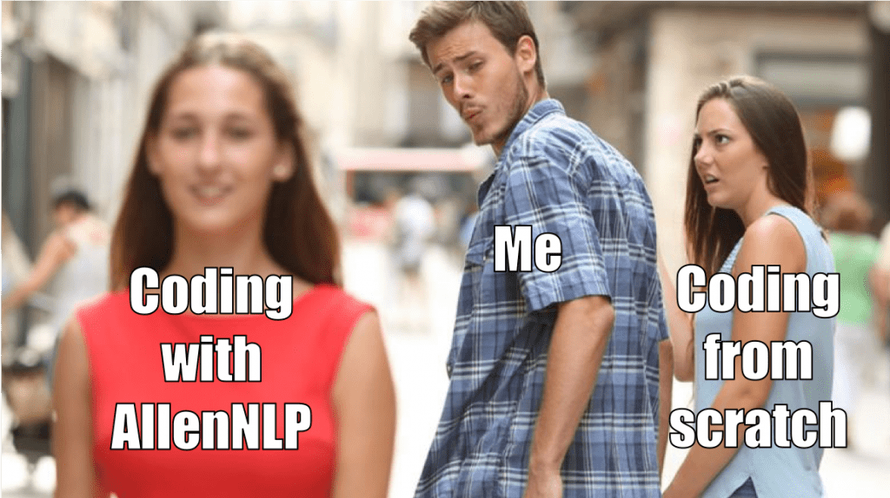
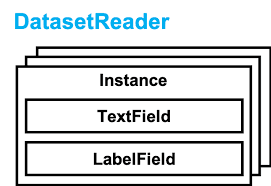

# 前言

本次将要介绍的是Allennlp框架，这是一个基于Pytorch，面向深度学习中的自然语言处理领域的框架，提供了众多的新兴算法和预训练模型，只需要简单的几行代码就可以完成很棒的功能。

本次教程，通过示例代码来讲解不同模块的使用方法和原理，希望通过本篇博文，大家能够顺利使用上[Allennlp](https://github.com/allenai/allennlp)，因为相比纯手动撸Pytorch，Allennlp真的能够加速Idea的实现。

> 参考论文：[AllenNLP: A Deep Semantic Natural Language Processing Platform](https://arxiv.org/abs/1803.07640)

# 介绍

Allennlp将NLP任务处理流程中的各个阶段都做了一定程度的抽象，在软件设计上讲就是，实现了高内聚，低耦合，让我们能够专注于特定模块的逻辑，而无需其他流程的改动，极大程度上减少了工作量。

那常用且重要的处理流程有：

- DatasetReader：从文件中读取数据，转化为Instance集合
- Model：模型主体
- Iterator：迭代数据，提取batch数据
- Trainer：模型训练器，并记录metric
- Predictor：使用训练好的模型来预测数据


以上每个pipeline是松耦合的，比如说从DatasetReader读取的vocab_size，input_embedding,等不需要单独配置，而是可以通过Vocabulary中的接口而获取。

每个NLP任务，都是从数据预处理开始，我们就先从DatasetReader开始将，然后顺着数据的处理流程来讲解其中不同的概念 ...

## DatasetReader

数据预处理，繁琐无聊但又少不了，而Allennlp让我们只关注于核心的数据读取，其他无聊的事情都帮我们做好，通用的东西绝对不让我们重复编码，因此我们只需要完成微乎几微的逻辑处理，比如在DatasetReader我们只需要实现两个函数即可：_read , text_to_instance，其内部实现的功能如下：

1. 从本地读取数据
2. 从数据中读取相关数据字段
3. 将提取的数据转化成Instance数组



示例代码如下：

```python
@DatasetReader.register("pos")
class PosDatasetReader(DatasetReader):
    """
    DatasetReader for PoS tagging data, one sentence per line, like
    The###DET dog###NN ate###V the###DET apple###NN
    """
    def __init__(self, token_indexers: Dict[str, TokenIndexer] = None) -> None:
        super().__init__(lazy=False)
        self.token_indexers = token_indexers or {"tokens": SingleIdTokenIndexer()}
    def text_to_instance(self, tokens: List[Token], tags: List[str] = None) -> Instance:
        sentence_field = TextField(tokens, self.token_indexers)
        fields = {"sentence": sentence_field}

        if tags:
            label_field = SequenceLabelField(labels=tags, sequence_field=sentence_field)
            fields["labels"] = label_field

        return Instance(fields)
    def _read(self, file_path: str) -> Iterator[Instance]:
        with open(file_path) as f:
            for line in f:
                pairs = line.strip().split()
                sentence, tags = zip(*(pair.split("###") for pair in pairs))
                yield self.text_to_instance([Token(word) for word in sentence], tags)
```

✨ 代码很简单。注意这里的text_to_instance函数是重写，也可以将text_to_instance中的代码搬迁到_read中，程序不会出错，只不过鉴于逻辑分离的规定，建议将不同逻辑的代码使用不同函数进行隔离。

🤔 这个时候，有心人会注意到，DatasetReader 和 Pytorch中的Dataset、DataLoader的异同点是啥？

🙋 答：DatasetReader是对后两者的融合。

- 相同点
    - 都完成数据的读取与抽象的功能
    - 都能够实现数据的懒加载（针对于大数据量的情况）
    - 都有加速数据读取的性能的机制
- 不同点
    - DatasetReader合二为一，更加简单易懂
    - DatasetReader只需要实现一个函数即可完成所有功能
    - DatasetReader能够在数据类型上支持多种不同NLP任务
    - 其他的我都不说了，反正很简单......🤡

说了不同点，可还没有说到其核心强大之处。我将以三点说：
- 懒加载数据
- 约定胜与配置
- 不同类型的Field

### 懒加载

在编写_read函数的时候，使用yield关键字返回数据，DatasetReader于是对于数据的读取天然有着一种lazy generator模式，支持懒加载数据，如果要开启lazy模式，只需要在传递lazy参数就行。

当然，对内存有所优化，在时间上就会有所消耗，针对不同的数据集使用不同的数据加载模式。

### 约定胜与配置

细心的朋友会发现，我们重写的是_read函数，这是一个似有函数的名称，也是整个数据读取最核心的函数。我们只需要实现这个函数，其他数据整理与读取进度条的展示等附带功能就会自动帮我们完成。

## 不同类型的Field

DatasetReader最终返回的是Instance实例的集合，而Instance实际上是一个字典类型的数据：`MutableMapping[str, Field]`，value是Field类型的数据，常用的Field类型有：

- TextField
- LabelField
- SequenceLabelField
- KnowledgeGraphField
- ...

首先，Field的作用就是将token转化成对应的index，且不同实现有不同的处理方法，详细可以去看[官方代码](https://github.com/allenai/allennlp)。

这里我就不一一介绍来，简单介绍几个。

先看TextField，用来存储序列（SequenceField）数据，在初始化的时候是需要传递token_indexers，这个可以对数据进行不同程度的分词处理。

而LabelField和SequenceLabelField就不需要token_indexers，因为本身就是label标签，是不需要分词处理。

🤔 好了，我们知道了Field是如何存储数据，那如何把字段塞进model.forward函数中去呢？

🙋 答：Instance中的key值与forward函数中的参数名对应。

比如以上代码中Instance中有sentence和label字段，则在model.forward函数中就应该有对应的参数，如：

```python
@Model.register("lstm-tagger")
class LstmTagger(Model):

    # 其他函数我就不展示出来了
    def forward(self,
                sentence: Dict[str, torch.Tensor],
                labels: torch.Tensor = None) -> Dict[str, torch.Tensor]:
        pass
```

看见没，Instance和model.forward函数的参数就是这样对应的。

【思考题】：咳咳～～，细心的朋友可能会观察到，sentence的数据类型是`Dict[str, torch.Tensor]`，可我在Instance中sentence存储的就是TextField，前面也说了，TextField本身就是需要将数据转化成index，然后用torch.tensor包装下就成了torch.Tensor数据类型，那为什么会是Dict[str,torch.Tensor]数据类型呢？
【线索】：token_indexers , 思考五秒钟......


## token_indexers & token_embedders

为了讲清楚这个问题，我们便跟随着sentence这个字段从读取到映射成词向量这整个流程来讲解。

sentence字段的处理分为以下几个阶段：
1. tokenizer -> 分词
2. Token     -> 转化为单个Token对象
3. Instance  -> 转化为Instance实例
4. Iterator  -> 并组装成batch模式
5. model.forward -> 塞给模型去执行
6. token_embedders -> 将idx转化成词向量

1. **tokenizer -> 分词**

这个过程是在文本读取的时候执行的。在DatasetReader初始化的时候，会将tokenizer传递到构造函数当中，没有的话就初始化一个默认分词器。这个分词器可以是一个，也可以是多个，取决于在参数列表里面传递的个数。

对于英文分词，allennlp有内置的WordTokenizer，可是中文分词的话，就需要自己手动构造一个：继承Tokenizer，然后注册。这样就可以在配置文件中通过type找到定制分词器。

```text
"I love cat" -> ["I", "love", "cat"]
```

2. **Token  -> 转化成单个Token对象**

如果看过Token源码就会知道，其核心存储着text，text_id,分别代表着分词的**文本**以及**索引**。

这个过程比较简单，没有什么逻辑。

```text
["I", "love", "cat"] -> [Token("I"), Token("love"), Token("cat")]
```

3. **Instance -> 转化为Instance实例**

这个过程一般是在DatasetReader的text_to_instance函数中完成，并针对不同字段转化成不同的Field。

```python
tokens = [Token("I"), Token("love"), Token("cat")]
token_indexers = {
    "word_token": SingleIdTokenIndexer(),
    "character_token": TokenCharactersIndexer()
}
instance = {
    "sentence": TextField(tokens, token_indexers)
}
```

4. **Iterator -> 组装成batch模式**

这个过程或许看不见，可是逻辑基本上固定，如无特殊需求，无需定制。

将Instance转化成idx的伪代码如下所示：

```python
instance = {
    "sentence": {
        "word_token": ["I", "love", "cat"] -> torch.Tensor([23, 55, 67]),
        "character_token": [["I"], ["l", "o", "v", "e"],["c", "a", "t"]] -> torch.Tensor([[23], [34, 78, 35, 36],[13, 74, 26]])
    }
}
```

然而，Iterator看似简单，可还有一些细节我想与大家聊聊：

- 在batch数据的时候，同batch中不同长度的数据是需要pad
- 为了pad过程的**性能**，可优先将长度相近的文本放置在同一个batch中
- 随机打乱数据

Allennlp已经内置了几个DataIterator，几乎不需要你自己重写，除非你在batch的过程中，完成一些创新性的小trick。

示例代码如下：

```python
from allennlp.data.iterators import BucketIterator
 
iterator = BucketIterator(batch_size=config.batch_size, 
                          biggest_batch_first=True,
                          sorting_keys=[("tokens", "num_tokens")],
                         )
iterator.index_with(vocab)
```

- sorting_keys 能够提升padding过程效率。
- index_with(vocab)非常重要：给token_indexers配置vocabulary。**这一步千万不要给忘记了**为什么要这样做呢？
    1. token_indexers是在dataset_reader初始化的时候才存在的，而vocabulary是需要基于dataset_reader读取的Instance集合才能够进行构建的，故此处矛盾，无法指定。
    2. token_indexers并非不能提取成一个单独的模块来指定Vocabulary，可从软件设计的角度来看，Field依赖于token_indexers，需要在初始化的时候就指定，故无法设计成一个单独的模块。
    3. 在iterator中指定vocabulary，然后由iterator将其传递给token_indexer的tokens_to_indices这个函数，此处的一个小trick就解决来依赖性的一个问题。


5. **model.forward -> 模型的参数**

Instance经过token_indexers转化成索引之后，由Iterator组装成batch数据，然后塞给模型的forward函数。

```python

token_embedders = {
    "word_token": TokenEmbedder(embedding_dim = 23),
    "character_token": TokenEmbedder(embedding_dim = 27)
}

text_field_embedders = BaseTextFieldEmbedder(token_embedders)

def forward(self,sentence: Dict[str,torch.Tensor]):
    sentence_embedding = text_field_embedders(sentence)
    
```

上述伪代码很简单的，不过需要注意几点：
1）text_field_embedders参数token_embedders的关键字和token_indexers的关键字必须要保持一致。
2）多种TokenEmbedders对同一个文本分别做处理并映射到词向量后，将其拼接到一起。比如上述两个token_embedder维度为23和27，sentence_embedding的维度就为50。通过简单的几行代码就可以完成很复杂的词向量拼接的功能。

Awesome～～

6. **token_embedders -> 词向量映射**

其实如何将将文本索引映射到词向量，第五点就已经说了。其核心需要注意的就是：
- token_indexers和token_embedders都是字典类型，且键值必须保持一致
- token_embedders处理后的词向量是拼接到一起**（这个特性非常棒）**

至此，我们跟随着sentence字段从读取到映射成词向量整个流程都已经聊完了，相信都已经掌握了。

至此，我已经将模型执行之前所有的注意点都给聊完了。


## Model

建议看看源码，因为看了源码你才会发现，Allennlp的model和module都是基于Pytorch的torch.nn.Module模块建立，所以我们可以很容易的使用Allennlp中的任何类。


为了说明Allennlp中的模型，我先与Pytorch中的模型做一个对比说明：

示例代码如下：
```python
def forward(self, tokens: Dict[str, torch.Tensor],
                id: Any, label: torch.Tensor) -> torch.Tensor:
        mask = get_text_field_mask(tokens)
        embeddings = self.word_embeddings(tokens)
        state = self.encoder(embeddings, mask)
        class_logits = self.projection(state)
         
        output = {"class_logits": class_logits}
        output["loss"] = self.loss(class_logits, label)
 
        return output
```

- Allennlp中的forward函数参数有的是一个字典类型（类似于TextField指定了TokenIndexer）的数据，有的是纯torch.Tensor数据。而Pytorch中的数据格式没有限制，自由度由自己控制，但推荐是torch.Tensor数据类型。
- Allennlpforward函数返回的也是一个字典类型的数据，其中最重要的就是损失函数值，必须将其存储在loss键下（这是一个**约定**），同时loss值的一个计算也是在forward函数中执行的。

至此，我们已经了解为什么forward函数有的参数为什么是字典类型。那我这里想问一个问题：

为什么forward函数返回的值也是字典类型？
答：因为在Trainer中有大用处，后面我会进一步讲解。

Allennlp为什么会这么好用呢？

答：因为里面将很多类似的组件，并将其抽象成模块来使用，常用的有：

- token_embedder
- encoder
- decoder

示例代码如下：

```python
from allennlp.nn.util import get_text_field_mask
from allennlp.models import Model
from allennlp.modules.text_field_embedders import TextFieldEmbedder
 
class BaselineModel(Model):
    def __init__(self, word_embeddings: TextFieldEmbedder,
                 encoder: Seq2VecEncoder,
                 out_sz: int=len(label_cols)):
        super().__init__(vocab)
        self.word_embeddings = word_embeddings
        self.encoder = encoder
        self.projection = nn.Linear(self.encoder.get_output_dim(), out_sz)
        self.loss = nn.BCEWithLogitsLoss()
         
    def forward(self, tokens: Dict[str, torch.Tensor],
                id: Any, label: torch.Tensor) -> torch.Tensor:
        mask = get_text_field_mask(tokens)
        embeddings = self.word_embeddings(tokens)
        state = self.encoder(embeddings, mask)
        class_logits = self.projection(state)
         
        output = {"class_logits": class_logits}
        output["loss"] = self.loss(class_logits, label)
 
        return output
```

上面代码中，encoder是Seq2VecEncoder（基类）类型，故可更改encoder的实现，并不改变模型内部的代码，实现组件的单独替换，而我们所需要做的，只需要添加Seq2VecEncoder的派生类即可。

这就是Allennlp的强大之处：所有的流程都抽象化，具体实现只需要自己指定或实现就行。

## Train

接下来就该讨论模型的**训练流程**了。

相比Pytorch繁杂且毫无新特性的训练过程，Keras和tensorflow框架就做的很好，只需要简单的几行代码就可以替代Pytorch多行手动编制的训练loop。

Allennlp抽象了一个Trainer，用来执行训练过程：更新梯度，保存日志文件（用tensorboard查看），保存best_model，良好的训练过程输出等等，这个训练器大大减少了我们的工作量。

示例代码如下，也是非常简单：

```python
from allennlp.training.trainer import Trainer
 
trainer = Trainer(
    model=model,
    optimizer=optim.Adam(model.parameters(), lr=config.lr),
    iterator=iterator,
    train_dataset=train_ds,
    cuda_device=0 if USE_GPU else -1,
    num_epochs=config.epochs,
)

trainer.train()
```

配置完Trainer，只需要指定train函数即可完成训练的整个过程。

# 总结

Allennlp非常好用，也有足够的定制化能力，也可以和Transformer完美结合在一起，同时也支持**semantic parsing**，**state machine**，未来也会添加更多更强大的模块。

[allennlp-tutorials](https://github.com/wj-Mcat/allennlp-tutorials)


# 参考链接：

- [an-in-depth-tutorial-to-allennlp-from-basics-to-elmo-and-bert](http://mlexplained.com/2019/01/30/an-in-depth-tutorial-to-allennlp-from-basics-to-elmo-and-bert/)
- [AllenNLP: A Deep Semantic Natural Language Processing Platform](https://arxiv.org/abs/1803.07640)